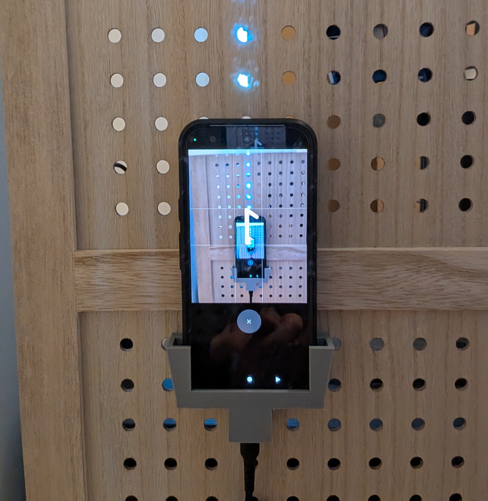
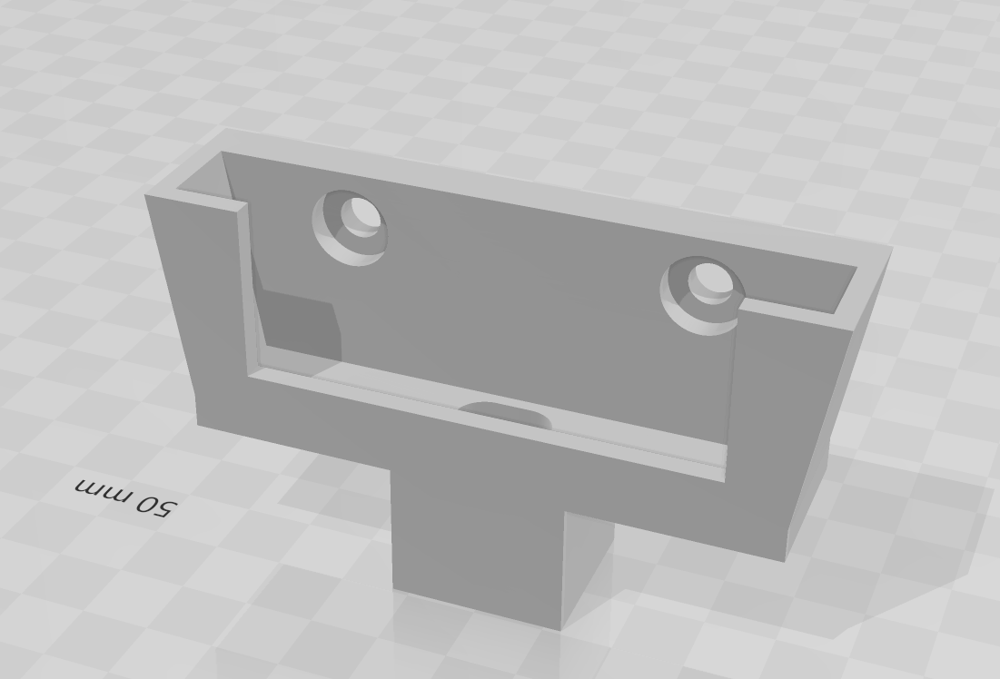
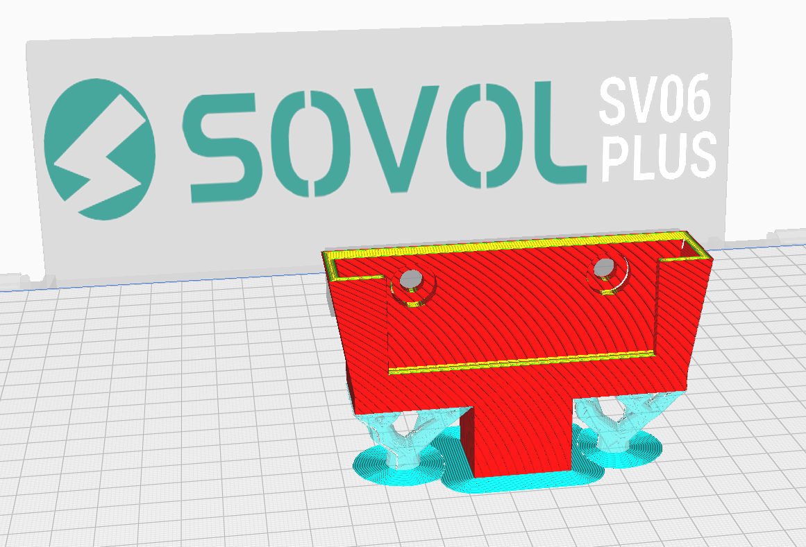

For use with a [Google Pixel 10](https://store.google.com/product/pixel_10) with this [case](https://www.amazon.ca/dp/B0F49DMKZN) and these [Magnetic USB C Adapters](https://www.amazon.ca/dp/B09WJWQMML).

Use any bolts you have lying around to secure it to pegboard or whatever and adjust `bolt_hole_diameter` `bolt_head_diameter` and `bolt_head_depth`.

I printed it upright like this:

with tree supports only under the sides on my [Sovol SV06 Plus](https://www.sovol3d.com/products/sovol-sv06-plus-ace-3d-printer) with [ANYCUBIC High Speed Rapid PLA Filament](https://www.amazon.ca/dp/B0CFV8QJGD) using `curaprofile.curaprofile`. It took just under 2 hours to print.
